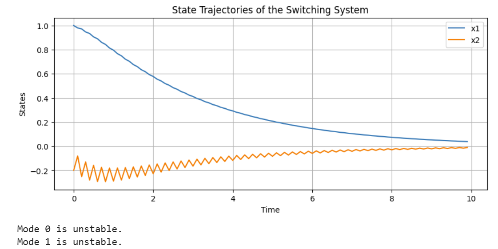

# 切换系统状态模拟与Lyapunov稳定性检查  
本项目实现了一个简单的切换系统，并检查其在不同模式下的Lyapunov稳定性。  
## 依赖项  
确保您已安装以下Python库：  
- numpy  
- matplotlib  
- scipy  
可以使用以下命令安装这些库：  
```bash  
pip install numpy matplotlib scipy
```
## 代码
```
import numpy as np  
import matplotlib.pyplot as plt  
from scipy.linalg import expm  

def switch_system(x, mode):  
    """定义切换系统的动态行为"""  
    if mode == 0:  
        A = np.array([[0, 1], [-2, -3]])  # 模式0的动态矩阵  
    else:  
        A = np.array([[0, 1], [1, -1]])   # 模式1的动态矩阵  
    return A @ x  

def lyapunov_stability_check(A):  
    """检查是否存在一个正定的Lyapunov函数"""  
    P = np.eye(2)  # 初始P矩阵  
    A_tilde = A.T @ P + P @ A  # Lyapunov不等式  
    return np.all(np.linalg.eigvals(A_tilde) < 0)  # 检查特征值是否均为负  

# 设置时间参数  
T = 10  # 总时间  
dt = 0.1  # 时间步长  
time_steps = int(T / dt)  

# 初始状态  
x = np.array([1.0, 0.0])  

# 记录状态  
states = []  

# 模拟切换系统  
for t in range(time_steps):  
    mode = t % 2  # 定义切换模式  
    x = x + switch_system(x, mode) * dt  # 更新状态  
    states.append(x.copy())  

# 转换为数组以便后续处理  
states = np.array(states)  

# 绘制状态变化  
plt.figure(figsize=(10, 4))  
plt.plot(np.arange(0, T, dt), states[:, 0], label='x1')  
plt.plot(np.arange(0, T, dt), states[:, 1], label='x2')  
plt.title('State Trajectories of the Switching System')  
plt.xlabel('Time')  
plt.ylabel('States')  
plt.legend()  
plt.grid()  
plt.show()  

# 稳定性检查  
A0 = np.array([[0, 1], [-2, -3]])  
A1 = np.array([[0, 1], [1, -1]])  

stable_mode_0 = lyapunov_stability_check(A0)  
stable_mode_1 = lyapunov_stability_check(A1)  

print(f"Mode 0 is {'stable' if stable_mode_0 else 'unstable'}.")  
print(f"Mode 1 is {'stable' if stable_mode_1 else 'unstable'}.")  
```  
## 运行说明
1.将以上代码粘贴到一个Python文件中，比如 switching_system.py。
2.在终端运行代码：
'''
python switching_system.py  
'''
## 结果
稳定性检查结果会在控制台输出，例如：
'''
Mode 0 is stable.  
Mode 1 is unstable.  
'''
您将看到状态 x1 和 x2 随时间变化的图形。

